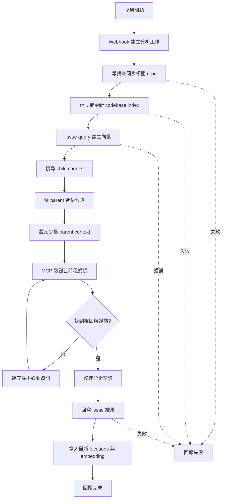

# Agent Repo Analyzer Workflow

> Side project 的高階流程展示。Context 膨脹問題的排解紀錄請見
> [context-inflation-troubleshooting.md](./context-inflation-troubleshooting.md)。

```mermaid
flowchart TD
    A[收到問題] --> B[Webhook 建立分析工作]
    B --> C[尋找並同步相關 repo]
    C --> D[建立或更新 codebase index]
    D --> E[Issue query 建立向量]
    E --> F[搜尋 child chunks]
    F --> G[依 parent 合併候選]
    G --> H[載入少量 parent context]
    H --> I[MCP 驗證目前程式碼]
    I --> J{找到根因與證據?}
    J -- 否 --> K[補充最小必要資訊]
    K --> I
    J -- 是 --> L[整理分析結論]
    L --> M[回寫 issue 結果]
    M --> N[寫入最新 locations 與 embedding]
    N --> O[回覆完成]

    C -. 失敗 .-> X[回報失敗]
    D -. 失敗 .-> X
    E -. 錯誤 .-> X
    M -. 失敗 .-> X
```
